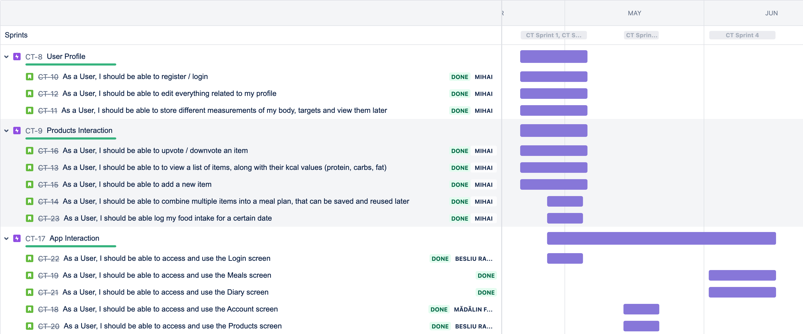
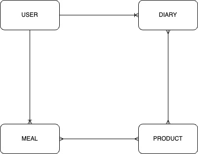
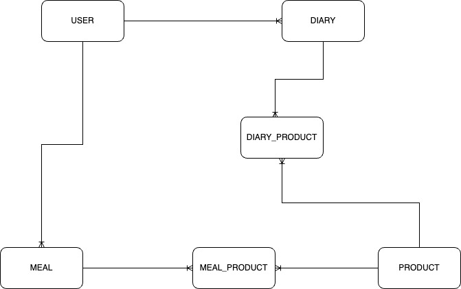
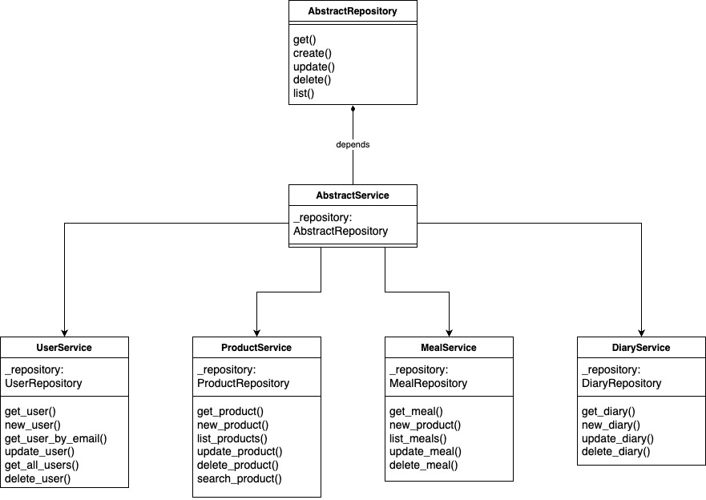
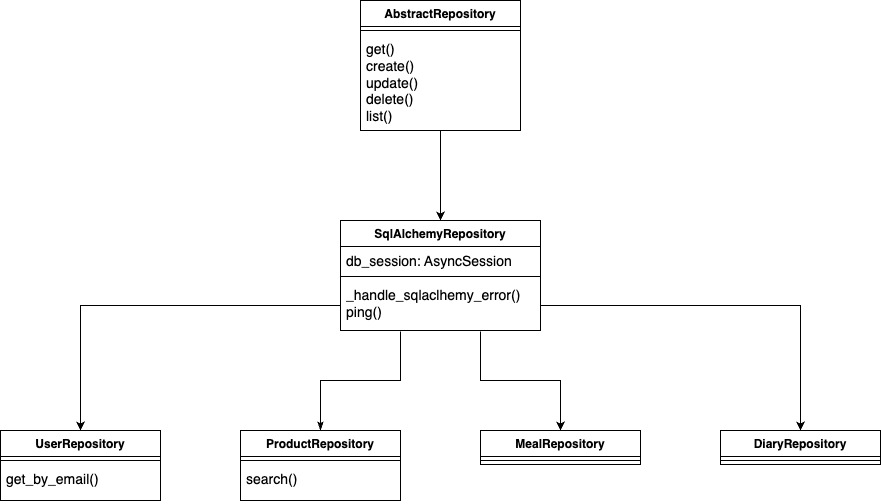

# Calorie Tracker App
@TODO APP DESCRIPTION

## Team members
- Besliu Radu Stefan
- Florea Madalin Alexandru
- Hutan Mihai Alexandru

###  1. UserStories
01. As a User, I should be able to register / login.
02. As a User, I should be able to edit everything related to my profile.
03. As a User, I should be able to store different measurements of my body, targets and view them later.
04. As a User, I should be able to upvote / downvote an item.
05. As a User, I should be able to to view a list of items, along with their kcal values (protein, carbs, fat).
06. As a User, I should be able to add a new item.
07. As a User, I should be able to combine multiple items into a meal plan, that can be saved and reused later.
08. As a User, I should be able log my food intake for a certain date.
09. As a User, I should be able to access and use the Login screen.
10. As a User, I should be able to access and use the Meals screen.
11. As a User, I should be able to access and use the Diary screen.
12. As a User, I should be able to access and use the Account screen.
13. As a User, I should be able to access and use the Products screen.

### 2. Backlog
This is a link to the [backlog roadmap](https://mirama.atlassian.net/jira/software/projects/CT/boards/2/roadmap)

### 3. Features List
-  User can create an account
-  User can login
-  User can edit profile
-  Can see all products
-  Can search for a product
-  Can add a product
-  Can edit a self added product
-  Can upvote/downvote a product
-  Can create self meals
-  Can see diary for a specific date
-  Can add/remove a meal to diary
-  Can add/remove products to diary

 
### 4. UML Diagrams

#### 4.1  Database Conceptual Model

#### 4.2  Database ERD

#### 4.3 Services Diagram

#### 4.4  Repository Diagram

### 5. Git repositories
- [Frontend](https://github.com/RaduBesliu/calorie-tracker-mobile)
- [Backend](https://github.com/hutanmihai/calorie-tracker-backend)

### 6. Technologies used
- Frontend - JavaScript, React Native
- Backend - Python, FastApi, PostgreSQL, Docker, Github Actions, Render, poethepoet

### 7. Automated tests
- [Tests folder](https://github.com/hutanmihai/calorie-tracker-backend/tree/main/app/tests)

### 8. Refactoring & code standards

#### 8.1 Manual refactoring
- Refactored custom error schema [here](https://github.com/hutanmihai/calorie-tracker-backend/commit/21de61a914bdc6f1815dd1608d05e8ded627df6c)
- Refactored tests with new error schema [here](https://github.com/hutanmihai/calorie-tracker-backend/commit/572ffa25d919c48d2224f5f5c27a66701dbe08de)

#### 8.2  Code standards
- In backend we followed the [PEP8](https://www.python.org/dev/peps/pep-0008/) code style guide for Python. We made sure that every single line pushed to the repository follows the PEP8 guidelines by using the `pre-commit` tool which runs linters checkers for python code. Here is the pre-commit configuration file: [pre-commit-config.yaml](https://github.com/hutanmihai/calorie-tracker-backend/blob/main/.pre-commit-config.yaml) and also the [flake8 file](https://github.com/hutanmihai/calorie-tracker-backend/blob/main/.flake8).
- Besides the pre-commit tool we also used Github actions to run the linters checkers for python code. Here is the [workflow file](https://github.com/hutanmihai/calorie-tracker-backend/blob/main/.github/workflows/main.yaml) for Github actions.
- Inside the Github action besides the linters we also ran two more actions, one for running tests, and one for automated deployment on render.com.

### 9. Design Patterns
- We used the Repository Pattern for the backend. The repository pattern is a kind of container where data access logic is stored. It hides the details of data access logic from business logic. In other words, we can say that the repository pattern acts as an in-memory collection of entities where data access logic is stored.
- In our backend we also used Decorators which are a design pattern promoted by python itself. The main usecase for it is in our APIs where we have a decorator that checks if the user is authenticated or not. Here is the decorator [file](https://github.com/hutanmihai/calorie-tracker-backend/blob/main/app/auth/auth_bearer.py).

### 10. AI Tools used in development
- During the development of the project we used [Github Copilot](https://github.com/features/copilot) which was mostly used for writing repetitive lines of code. One example would be the custom errors [here](https://github.com/hutanmihai/calorie-tracker-backend/blob/main/app/services/errors.py) and [here](https://github.com/hutanmihai/calorie-tracker-backend/blob/main/app/repositories/errors.py).
- We also used [ChatGPT](https://chat.openai.com/) for different types of error analysis and other short questions that normally would've been asked on [Stackoverflow](https://stackoverflow.com/).

## Backend Documentation
- [Readme](https://github.com/hutanmihai/calorie-tracker-backend/blob/main/README.md)
- [PDF](https://github.com/hutanmihai/calorie-tracker-backend/blob/main/MDSBackendDocumentation.pdf)
- [Swagger](https://calorietracker.eu/docs)
